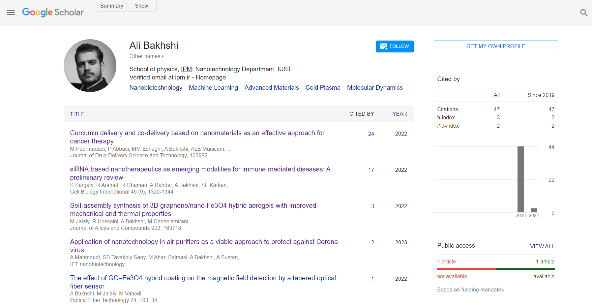
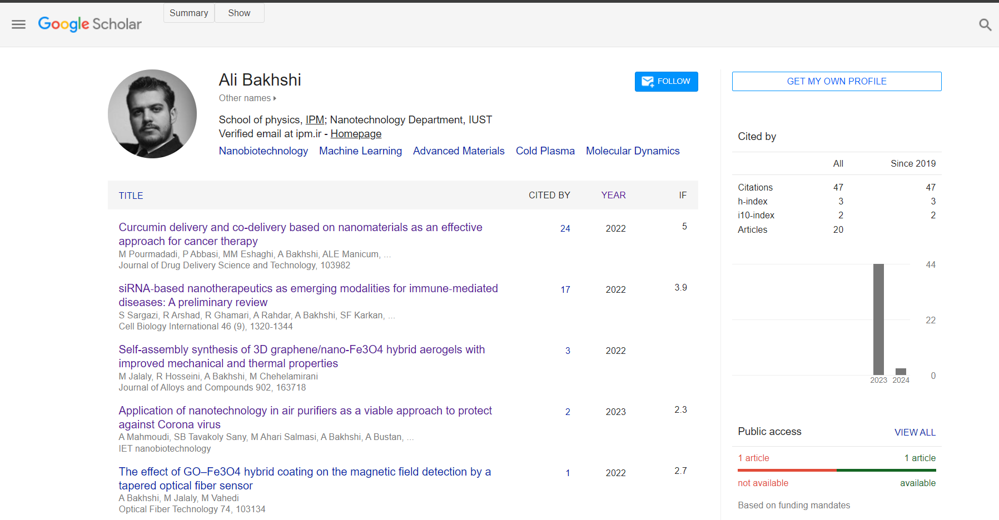

# Google-Schoolar-Analyzer-Extension
A Chrome browser extension for advanced analysis of Google Scholar profiles like impact factors (IFs) and total number of documents. 

  

<h1> 📜 How to run?</h1>
<ol>
<li> Download the codes</li>
<li> Enable Developer mode in Chrome browser "manage extensions" or "chrome://extensions/"</li>
<li> Load the extension</li>
<li> Load a google scholar profile and click on "show" </li>
</ol>

<h1> 📜 How it works!</h1>
<ul>
<li> Extracts journal name from article lists</li>
<li> Finds journal impact from "data/JCR2023IF.json" (JCR 5-years IFs 2018-2023)</li>
<li> Inserts a column next to year and shows IF of the journal</li>
<li> Counts all documents and inserts total number of documents</li>
</ul>
<h2 align="center"> Before click! </h2>

  

<h2 align="center"> After click! </h2>

  

